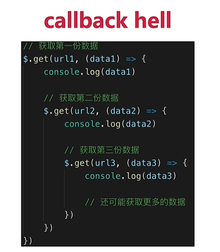

### 原型相关

#### class的组成

- constructor
- 静态属性
- 实例属性
- 方法

```js
/* 
使用ES6的类设计并测试以下需要
  需求1: 
    现在2个人, 都有姓名与年龄(值自己指定), 都能自我介绍自己的姓名和年龄, 能得到当前的总人数
  需求2: 
    现在又有了一个学生, 它有身价的属性, 能介绍它的所有信息
    又有一个老师, 它有教授课程的属性, 能介绍它的所有信息
*/
```


#### 原型

- 每个class/函数都有一个显示原型: `prototype`
- 每个实例都有一个隐式原型: `__proto__`
- 实例的`__proto`与对应class的`prototype`都指向原型对象
- 原型对象上有一个`constructor`属性指向对应的class/构造函数


#### 查找对象上属性的基本流程

- 先在对象自身上查找, 如果有, 直接返回
- 如果没有, 根据`__proto__`在原型对象上查找, 如果有, 直接返回
- 如果没有根据原型对象的`__proto__`在原型对象的原型对象上查找, 直接查找到Object原型对象为止
- 如果找到了返回, 如果查找不到由于它的`__proto__`为null, 只能返回undefined

#### 原型链: 

- 从对象的`__proto__`开始, 连接的所有对象, 就是我们常说的原型链, 也可称为`隐式原型链`
- 查找对象属性简单说: 先在自身上查找, 找不到就沿着原型链查找,如果还找不到返回undefined

#### instanceof

- 作用: 判断一个任意类型对象的具体类型

- 如何判断的: 
  - 对于 A instanceof B
  - A是实例对象, B是构造函数
  - 如果B的prototype属性所指向的对象是A实例对象的原型链接上的某个对象, 返回true, 否则返回false

#### 原型与原型链结构图

```js
function Foo () {}
const f1 = new Foo()
const f2 = new Foo()

const o1 = new Object()
const o2 = {}

Foo instanceof Object
Foo instanceOf Function
Object instanceof Object
```


### 作用域相关

#### 作用域

变量可以合法使用的范围


#### 作用域分类

- 全局作用域
- 函数作用域
- 块级作用域(ES6新增)

#### 作用域链

多个嵌套的作用域形成的由内向外的结构, 用于查找变量


#### 变量提升与函数提升

- 变量提升: 在变量定义语句之前, 就可以访问到这个变量(undefined)
- 函数提升: 在函数定义语句之前, 就执行该函数
- 原因: 简单来说就是在执行全局代码和函数前会进行预解析/处理


#### 闭包

- 理解:

  - 当嵌套的内部函数引用了外部函数的变量时就产生了闭包
  - 什么时候产生的闭包?  执行内部函数定义(创建函数对象)后

- 通过chrome工具得知: 闭包本质是内部函数中的一个对象(非js的), 这个对象中包含引用的变量属性

- 作用

  - 延长局部变量的生命周期
  - 让函数外部能操作内部的局部变量

- 写一个闭包程序

  ```js
  function fn1() {
    var a = 2;
    function fn2() {
      a++;
      console.log(a);
    }
    return fn2;
  }
  var f = fn1();
  f();
  f();
  
  
  function showDedelay (time, msg) {
      setTimeout(() => {
          alert(msg)
      }, time)
  }
  showDelay(1000)
  ```

  

- 闭包应用

  - Vue项目: 

#### this在不同场景下的取值?

- this学习的2个目标:
  - **能判断出函数中的this是谁**
  - **能控制函数的this是需要的特定对象**

- 常规情况下, 函数中的this取决于执行函数的方式
  - fn(): 直接调用  ==> **this是?**  window
  - new fn(): new调用 ==> **this是?**  新建的对象
  - obj.fn(): 通过对象调用 ==> **this是?**  obj
  - fn.call/apply(obj): 通过函数对象的call/apply来调用 ==> **this是?**  obj

- 特殊情况:
  - bind(obj)返回的函数  ==> **this是?**  obj
  - 箭头函数 ==> **this是?**  外部作用域的this
  - 回调函数
    - 定时器/ajax/promise/数组遍历相关方法回调  ==> **this是?**  window
    - vue控制的回调函数  ==> **this是?**  组件的实例
    - React控制的生命周期回调, 事件监听回调  ==>  **this是?**  组件对象 / undefined

- 如何控制函数的this?  
  - 利用函数的bind()
  - 利用箭头函数
  - 也可以用外部保存了this的变量

### 异步相关

#### 单线程与异步

- JS是单线程编程语言, 只能同时做一件事
- 浏览器和 nodejs 已支持 JS 启动分线程, 如: Web Worker
- JS 和 DOM 渲染共用主线程, 因为 JS 可以修改 DOM 结构
- 遇到需要等待 (网络请求, 定时任务) 不能卡住
- 需要异步
- 回调callback函数

#### 同步与异步

- 基于 JS 是单线程编程语言
- 同步会阻塞代码执行
- 异步不会阻塞代码执行

#### 使用Promise解决回调地狱问题

Promise相对纯回调形式, 指定回调函数的时机更灵活(可以在发送请求后或请求结束后)




#### event loop1

- js是单线程运行的
- 异步要基于回调来实现
- event loop 就是异步回调的实现原理

.png)


#### 宏任务与微任务

- 宏任务: setTimeout, setInterval, Ajax, DOM事件监听
- 微任务: Promise, async/await, mutationobserver

#### 宏队列与微队列

- 宏队列: 用来保存n个宏任务的队列容器
- 微队列: 用来保存n个微任务的队列容器

#### event loop2

- js-web中的dom事件回调, 定时器回调与ajax回调异步执行, 都是基于event loop   ===> 宏任务
- H5新的MutationObserver也基于event loop   ==> 微任务
- promise成功和失败的回调也是异步执行的, 也是基于event loop  ==> 微任务


#### Promise的三种状态

- pending resolved/fulfilled rejected
- pending --> resolved
- pending --> rejected
- 变化不可逆

#### async/await与promise的关系

- async/await是消灭异步回调的终极武器
- 但和Promise并不互斥
- 反而, 两者相辅相成
- 执行async函数, 返回promise对象
- await相当于promise的then
- try...catch可捕获异常, 相当于promise的catch

### ES6+

